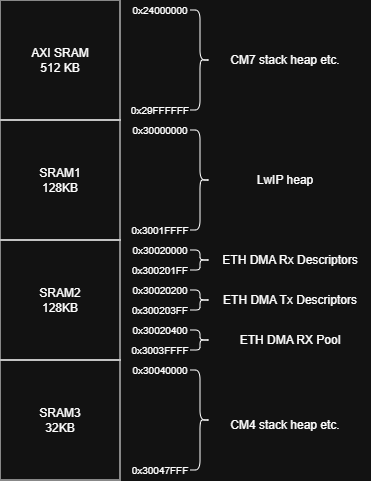

# LwIP + FreeRTOS on STM32H755ZI (CM7)

A high-performance implementation of LwIP + FreeRTOS running on the Cortex-M7 core of the STM32H755ZI.

I initially created this project to familiarize myself with the STM toolchain. The examples provided by STM and any other public repos I could find were questionable at best, so I published it to provide a well tuned reference.

This README provides a high-level overview of the project. It assumes familiarity with STM32, FreeRTOS, and LwIP. For full details, refer to the .ioc file and source code.

## Description

### Test Suite

Right now there are two tests in _cube_lwip_rtos_CM7/Core/Src/tests.h_.

* _udp_tx_benchmark()_. It is used to test the stack by itself. There is no need to set up a server on host machine, just a packet sniffer like Wireshark is enough to validate its functionality. There are two implementations, one with the RAW API and one with the socket API.

* _tcp_loopback()_. It requires the host machine to have set up its ethernet connection with the IP address 192.168.0.1 and subnet mask 255.255.255.0, and run the server.py script first. It achieves a throughput of 92.8 Mbps on the application level. Right now there is only a socket API implementation.

### Memory Management
The following diagram shows how the RAM of the device is set up. AXI SRAM, SRAM1 and SRAM2 are exclusive to CM7 while SRAM3 is exclusive to CM4. To achieve this, the MPU settings and the linker scripts have been modified.



The MPU settings follow the logic of the STM guides. LwIP heap and the DMA descriptors are non cacheable, while the RX Pool is cacheable.

The used memory can be pruned quite a bit if such a need arises.

FreeRTOS has a heap of 15360 Words while the following threads exist:
| Task            | Stack Size |
|-----------------|-----------:|
| defaultTask     | 256 words  |
| EthLink         | 256 words* |
| tcpip_thread    | 2048 words |
| slipif_loop     | 1024 words |
| lwIP            | 2048 words |

> [!WARNING]  
> _EthLink_ is set to 87 words by default, this produces hard crashes. It can not be changed in CubeMX, the macro _INTERFACE_THREAD_STACK_SIZE_ in _ethernetif.c_ has to be modified.

The LwIP heap is set to 128KB but according to lwip stats the maximum usage that has been observed after hours of operation is at ~26KB.

According to Build Analyzer the DMA RX Pool takes 61,25 KB. The size of it depends on the ethernet settings described in the following section.

### Ethernet Data Corruption

The server.py script reports if any packets have been lost or corrupted. There seems to be some random and infrequent data corruption, depending on the throughput. The MAC layer and LwIP are raising no errors, and the frequency of the corruptions are also depended by the resources allocated to the ethernet DMA.

I suspect the cause is that the DMA handling in STM drivers is problematic and the corruption is produced by cache coherency issues. Trying to set up the DMA RX pool as non cacheable produces hard faults, likely due to DMA alignment or descriptor expectations, and cannot be used to alleviate this problem. 

What I found reduces the corruption rate is increasing the number of ethernet descriptors. This probably reduces the hit rate on the cache and minimize the corruption as a sideeffect.

| ETH Descriptors |  Corruption Rate |
| --------------: | ---------------: |
|               8 | 1 / 175k packets |
|              12 | 1 / 800k packets |
|              16 |  1 / 30m packets |

1 corrupted packet per 30 million is acceptable for this demo. Furthermore, the size of the DMA RX Pool depends on the settings of the Ethernet, thus there is a limit on the number of descriptors. If you require zero packet corruption, increasing the Ethernet descriptors is most probably not enough, the drivers need some touching.

The _ETH_RX_BUFFER_CNT_ & _PBUF_POOL_SIZE_ constants of LwIP have to also be increased accordingly to the number of ETH descriptors.

### LwIP Settings

The default settings of LwIP in CubeMX are not acceptable and need quite a bit of tuning. Don't forget to check _Show Advanced Parameters_ when looking at _Key Options_. In addition to the PBUF and TCP settings that are commonly recommended to be changed, the MBOX settings need tuning too. With their default values, the mailbox queues of LwIP are constantly full leading to throughput drops. This error can be identified by the sys.mbox.err counter in lwip_stats, and fixing it is quite cheap, just a few hundred bytes at max.

### Other Settings

* As is common, TIM6 is used as timebase source for CM7, as required by FreeRTOS.
* The operating clock of CM7 is set up to 400MHz. It could be raised up to 480MHz but I didn't really want to deal with the power supplies and regulator.

## How to Run

* Open the project in STM32CubeIDE.
* Before building select test and implementation:
    - in main.c #define UDP_TX_BENCHMARK 1 for UDP test.
    - in main.c #define UDP_TX_BENCHMARK 0 for TCP loopback test.
    - in tests.h #define USE_SOCKETS 1 for socket implementation.
    - in tests.h #define USE_SOCKETS 0 for RAW implementation.
* Build both CM7 and CM4 targets.
* Load both .elf files to the device.
* If chosen the TCP application, set up the Ethernet adapter as described in the _Test Suite_ section and run the server.py script on the host PC before booting the device.

## Repo Structure
```
cube_lwip_rtos_2/
├── CM7/   # FreeRTOS + LwIP application
├── CM4/   # Secondary core application
docs/
server.py  # TCP loopback server
```
## Tools Used
* STM32CubeMX 6.17.0
* STM32Cube FW_H7 V1.13.0
* STM32CubeIDE 2.1.1
* FreeRTOS 10.6.2
* CMSIS-RTOS 2.1.3
* LwIP 2.2.1

## TODOs
* TCP loopback RAW API implementation
* TCP loopback where the send and receive are in different tasks in order to mimic a real application where there is a pipeline between them.